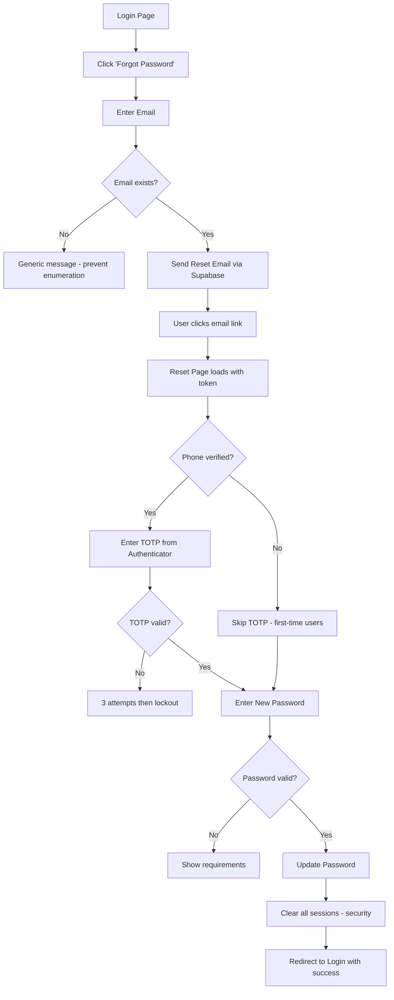

# 🔐 Forgot Password Feature - Design Analysis

**Author:** Security Analysis  
**Date:** 2026-01-30  
**System:** Smash Partner PWA (B2B Badminton Court Management)

---

## 📋 Executive Summary

**Recommendation:** ✅ **YES, implement Forgot Password** - It is an essential feature for production-ready B2B applications.

This document analyzes the optimal password reset flow for Smash Partner PWA, considering the unique context of a B2B venue management system with sensitive payment data.

---

## 🎯 Context Analysis

### System Characteristics

| Factor | Value | Implication |
|--------|-------|-------------|
| **User Type** | Venue Owners/Staff (B2B) | Higher security expectations |
| **Data Sensitivity** | High (payments, transactions) | Need robust verification |
| **Phone Verification** | Already implemented (TOTP) | Can leverage existing system |
| **Auth Provider** | Supabase Auth | Built-in `resetPasswordForEmail` |
| **User Count** | Expected low-medium (venues) | UX > bulk efficiency |

### Current Authentication Flow
```
User → Email/Password → Phone Verification (TOTP) → Dashboard Access
```

---

## 🔀 Flow Options Comparison

### Option A: Standard Email-Only Reset ❌
```
User clicks "Forgot Password" → Enter Email → Receive Email Link → Set New Password
```

| Pros | Cons |
|------|------|
| Simple to implement | Single point of failure |
| Standard UX pattern | Email could be compromised |
| Supabase built-in support | No additional verification |

**Verdict:** Too weak for B2B system with payment data.

---

### Option B: Email + Phone TOTP Reset ✅ **RECOMMENDED**
```
User clicks "Forgot Password" 
    → Enter Email 
    → Receive Email Link 
    → Open Link → Verify Phone TOTP 
    → Set New Password
```

| Pros | Cons |
|------|------|
| Two-factor verification | Slightly more complex UX |
| Leverages existing phone verification | Requires phone access |
| Matches security posture of system | |
| Protects against email-only attacks | |

**Verdict:** Best balance of security and UX for B2B venue system.

---

### Option C: Phone-Only OTP Reset ❌
```
User clicks "Forgot Password" → Enter Phone → Receive SMS OTP → Set New Password
```

| Pros | Cons |
|------|------|
| Fast for mobile users | SMS costs (per message) |
| No email access needed | SIM swap attacks possible |
| | Requires SMS provider integration |

**Verdict:** Too expensive and less secure than TOTP.

---

### Option D: Admin-Assisted Reset
```
User contacts Admin → Admin verifies identity → Admin triggers reset
```

| Pros | Cons |
|------|------|
| Maximum security | Not scalable |
| Last resort option | Poor UX |

**Verdict:** Keep as manual fallback only.

---

## 🏆 Recommended Implementation: Option B

### User Flow Diagram



### Security Features

1. **Email enumeration prevention** - Always show generic message
2. **Rate limiting** - Max 3 requests per email per hour
3. **TOTP verification** - For phone-verified users
4. **Session invalidation** - Clear all sessions on password change
5. **Secure token** - Supabase handles token expiry (1 hour)
6. **Password requirements** - Min 8 chars, complexity rules

### UX Considerations

1. **Clear instructions** - Step-by-step guidance
2. **Mobile-friendly** - Works on venue owner's phone
3. **Offline awareness** - Show message if offline (PWA)
4. **Indonesian language** - Match existing UI
5. **Success feedback** - Clear confirmation

---

## 📁 Implementation Structure

### New Files Required

```
src/
├── app/
│   ├── forgot-password/
│   │   └── page.tsx           # Email entry form
│   └── reset-password/
│       └── page.tsx           # New password form + TOTP
├── lib/
│   └── password-reset.ts      # Reset utility functions
└── components/
    └── auth/
        └── password-reset-form.tsx
```

### API Routes

| Route | Method | Purpose |
|-------|--------|---------|
| Built-in Supabase | - | `resetPasswordForEmail` |
| No custom API needed | - | Supabase handles tokens |

### Database Changes

None required - Supabase Auth handles password reset tokens internally.

---

## 🔒 Security Checklist

- [ ] Rate limit forgot password requests (3/hour/email)
- [ ] Never reveal if email exists or not
- [ ] Require TOTP for phone-verified users
- [ ] Enforce strong password requirements
- [ ] Clear all sessions on password change
- [ ] Log password reset attempts for audit
- [ ] Set reset link expiry (1 hour via Supabase)
- [ ] Validate token before showing password form

---

## 📊 Why This Flow is Best for Smash Partner

1. **Matches existing security model** - Already uses phone TOTP for verification
2. **Zero SMS costs** - Reuses authenticator app approach
3. **B2B appropriate** - Higher security for business users
4. **Supabase native** - Leverages built-in reset functionality
5. **Fast implementation** - ~4-6 hours development time

---

## 🚀 Next Steps

After approval of this design:

1. Create `/forgot-password` page
2. Create `/reset-password` page with TOTP integration
3. Add `resetPassword` function to `auth.ts`
4. Update login page with "Forgot Password?" link
5. Test complete flow
6. Add to security audit documentation

---

## 📚 References

- [Supabase Password Reset](https://supabase.com/docs/guides/auth/passwords#resetting-a-password)
- [OWASP Forgot Password Cheat Sheet](https://cheatsheetseries.owasp.org/cheatsheets/Forgot_Password_Cheat_Sheet.html)
- Current phone verification: `src/lib/phone-verification.ts`
